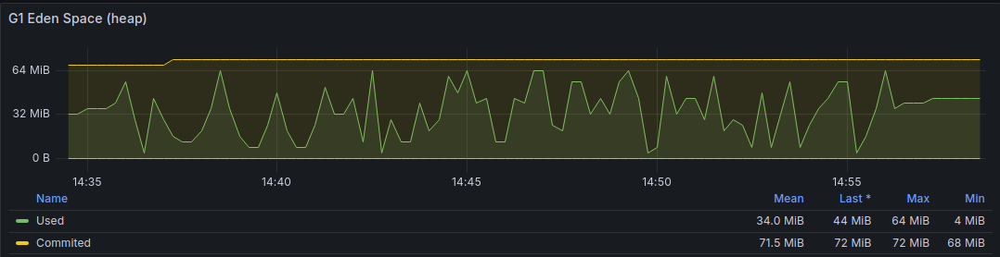
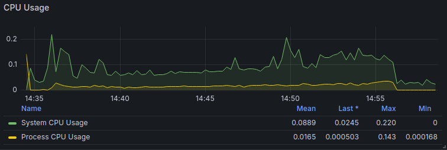
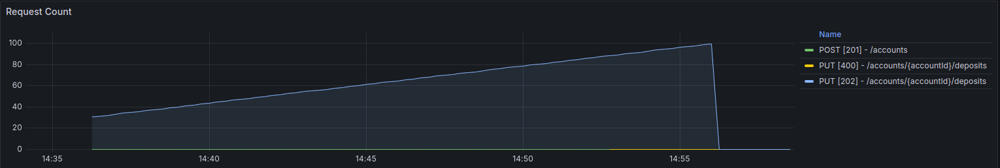
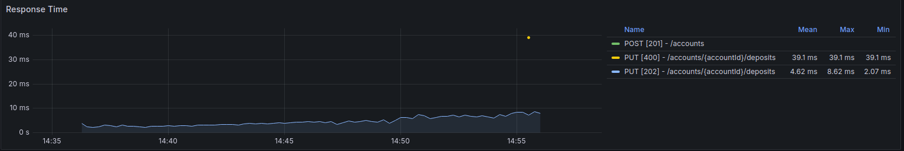
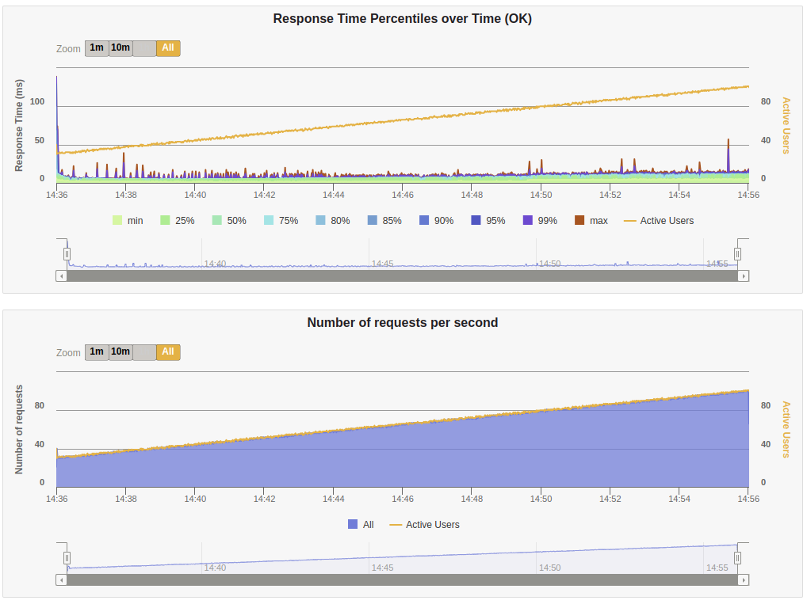

## Event Sourcing Bank Account

A lightweight, event sourced Account implementation with Kotlin, arrow-kt and pure functions.

### Theoretically background

The theoretically background can be found on the [blogpost](https://javacaptain.com/2024/04/event-sourcing-with-kotlin/).

### Overview

This project is meant to present a key technique. It has only a demonstration and educational purpose.
The code is far from being called production, many oversimplifications have been used.
I tried to share the knowledge I gained by implementing similar systems.
The project was made using the Kotlin programming language and Arrow-kt library. Postgresql database was chosen as the event store.
It also uses spring-boot but only outside the domain. The framework is only an implementation detail. 
It can be replaced by any other famous alternative or removed completely and the core functionality will not notice.  

#### Domain
The domain consists of so-called pure functions - they take input and produce output. 
All state modifications, side effects, etc. are eliminated. 
Immutability of objects is a very important characteristic that is followed.

Three operations can be performed on an account - open, deposit, withdraw.
`AccountCommandHandler` is the place where we apply business rules based on recreated state and current command.
`AccountEventHandler` is responsible for recreating the state from the list of events.

#### Event sourcing
Event sourcing is a method of storing data where the state is recorded as a series of domain events rather than as a final state. 
While it offers advantages like an automatically generated audit log through these events, there are complexities to consider as well. 
As the software evolves and the volume of stored data increases, managing and working with the data can become challenging.

One significant benefit of event sourcing is the ability to create different read-optimized views of the data 
for various purposes using patterns like Command Query Responsibility Segregation (CQRS).
In addition to these benefits, event sourcing offers several other advantages. 
It promotes traceability and enables comprehensive auditing by capturing every state-changing action as an event. 
This not only facilitates debugging and troubleshooting but also provides valuable insights into the history of the system's data. 
Furthermore, event sourcing enhances resilience and fault tolerance by allowing for easy restoration of system state from event logs in the case of failures or errors.

#### Consistency
Immutable objects and the event store are keys to ensuring consistency in a multithreaded environment.

After retrieving the current state, we determine the sequence number of the latest event. 
This number is incremented by one for each subsequent event we intend to insert. 
In the event that another client inserts an event before us, our transaction will be rejected due to this constraint. 
Consequently, we must re-read the current state and attempt the transaction again.

### API

- open account: `POST /api/v1/accounts` with respective json body should respond with `201`
  and a `Location` header pointing to the created resource if successful
- get account's current state: `GET /api/v1/accounts/{accountId}` should respond with `200`
  and a json body if account is found
- deposit: `PUT /api/v1/accounts/{accountId}/deposits` with respective json body
  should respond with `202` if successful
- withdraw: `PUT /api/v1/accounts/{accountId}/withdraws` with respective json body
  should respond with `202` if successful


#### Idempotency

Ensuring idempotency is crucial when handling financial transactions, especially across an unreliable network. 
In such scenarios, where interruptions are common, clients may unknowingly resend requests, 
potentially resulting in duplicate transfers, deposits, or withdrawals if the original request was successfully processed. 
To mitigate this risk, clients should include a unique transaction ID (such as a UUID) with each operation. 
This ID is persisted, allowing duplicate requests to be rejected without triggering additional actions since they have already been handled.


### Testing
Having a domain free of all dependencies, and built with pure functions, unit testing becomes extremely easy.
We all know how to test a function, we give it input and check the output.

However, unit testing is not enough to feel confident with a solution. 
Therefore, integration tests has been added, using a real database.
For this purpose, testcontainers was used.
In addition, to test the behavior of our application in a multithreaded environment, a so-called `AccountConsistencyTest` was created.

To see how the application behaves under load gatling tests were added.


### Simplifications and imperfections

- Missing snapshotting. This is a very useful technique if you are thinking about production use of event sourcing.
It reduces query time and improves overall application performance. 
However, I have not applied it in this demo project. Maybe I will do it in the near future.

- The representation of money is heavily neglected and simplified. 
I use Long, and support for multi-currency is also lacking. 
This is a conscious decision, I just preferred to focus on other aspects of the code.

- API exception handling could be better. The API only supports basic use cases, however, 
as with money I just preferred to focus on other aspects of the code.

- Certain parts of the code could be polished with Uncle Bob's “Clean Code.” 
However, I think that overall the code is fine and can be understood avoiding major misunderstandings.

### Building

Nothing fancy, just:
```shell script
./gradlew build
```

### Running

The service can be spawned in a very minimal production-like environment using `docker compose` 
A minimal monitoring setup is available, as well.(However, certain key components like logs and traces are missing.)

To start:
```shell script
docker compose up
```
The service will be accessible on localhost:8080 and requests
will go via a load balancer to two service instances in a round-robin fashion.

To stop:
```shell script
docker compose down
```

### Observability
Grafana is available on port 3000. Dashboards are available for basic service metrics and JVM metrics.
When running stress tests with gatling we can observe a few dashboards:






The results shown are for illustrative purposes only and should be taken with a pinch of salt, as they were made on localhost.


